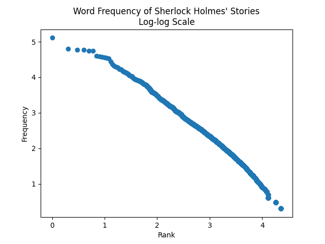

# Demonstrating Zipf's law using Sherlock Holmes' stories
[Zipf's law](https://en.wikipedia.org/wiki/Zipf%27s_law) states that the frequency of words found in books follows a power law. That is, the counts of certain words are inversely proportional to their ranks, wherein the most common word occurs twice as often as the second most frequent word, three times as often as the subsequent word, and so on.

The code demonstrates this empirical law by counting the occurence of words in all Sherlock Holmes' stories and plotting the frequencies on a log-log scale. A linear relationship can be observed, suggesting the power law holds for these data:

The stories are available for download on [Kaggle](https://www.kaggle.com/datasets/idevji1/sherlock-holmes-stories).
